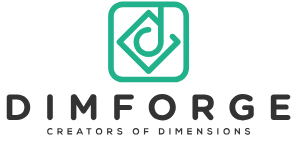

# 关于Rapier {#about-rapier}

Rapier是一套使用Rust编程语言编写的2D和3D物理引擎。它针对需要实时物理处理的应用程序，如视频游戏、动画和机器人技术。它被设计为快速、稳定，并且可选择的跨平台确定性。Rapier的特性包括：
- 刚体碰撞和力
- 关节约束
- 接触事件和传感器
- 快照
- 可选的跨平台确定性
- JavaScript
- 更多...

Rapier是自由和开源的，遵循Apache 2.0许可证发布。它由[Dimforge公司](https://dimforge.com/)开源开发。您可以通过在[GitHub赞助商](https://github.com/sponsors/dimforge)上赞助我们来支持我们。
